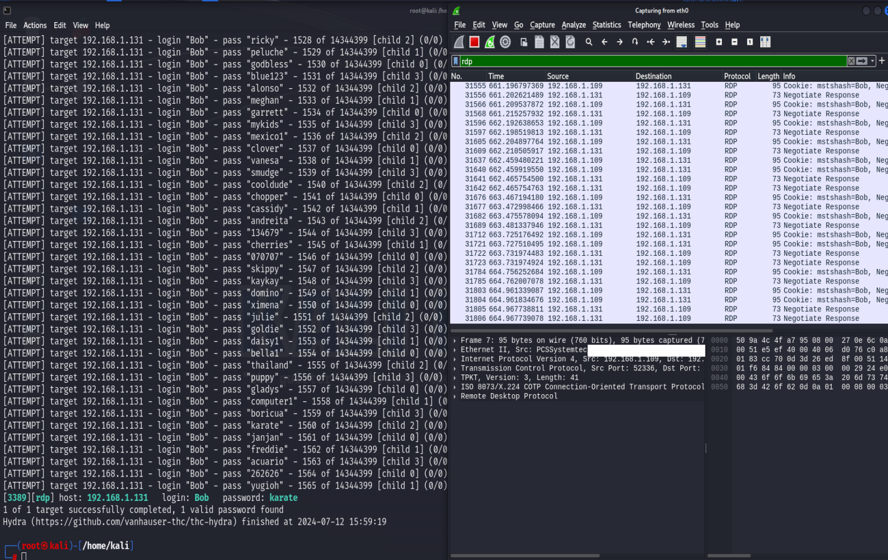

# RDP-Brute-Force-Attack-and-Remote-Login

This lab demonstrates using hydra to perform a brute force attack on a Windows 10 PC with the RDP protocol. Then from there initiating a successful login to the target system with the compromised login credentials using xfreerdp.

## Performing an nmap scan on port 3389 of the target

## Using Hydra to run a brute force login scan on the target using the rdp protocol

